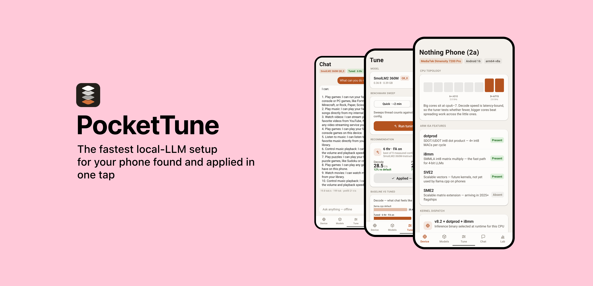
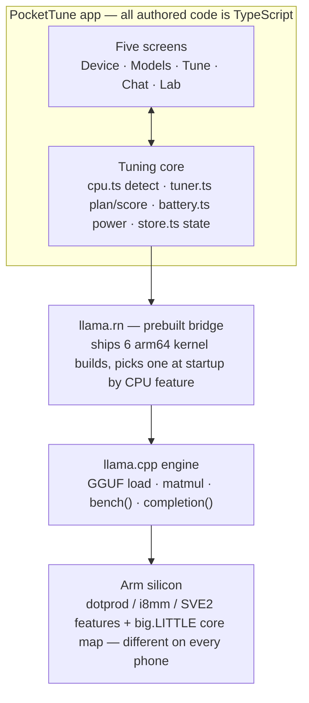
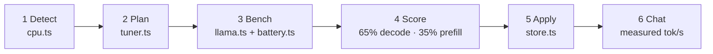
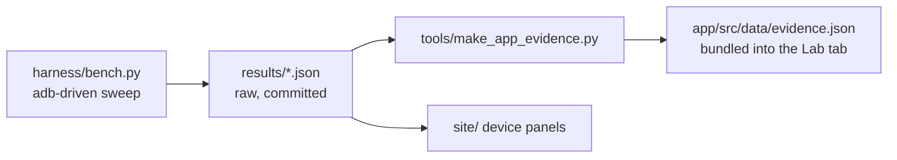

<p align="center">
  <!-- <a href="https://github.com/ayanbag/PocketTune/actions/workflows/pages.yml"></a> -->
  <a href="https://github.com/ayanbag/PocketTune/actions/workflows/release.yml"></a>
  <a href="https://github.com/ayanbag/PocketTune/releases/latest"></a>
  <a href="LICENSE"></a>
  <a href="https://arm-ai-optimization-challenge.devpost.com/"></a>
</p>

**Finds and applies the fastest local-LLM configuration for the phone it runs on.**

PocketTune is an Android app that detects your phone's Arm CPU features, benchmarks a sweep of
LLM inference configurations **on the device itself**, then recommends and applies the fastest
one — and gives you a fully offline chat app running on it.

Built for the [Arm Create: AI Optimization Challenge 2026](https://arm-ai-optimization-challenge.devpost.com/) (Mobile AI track).

> Arm phones differ in silicon. Some cores have `i8mm` matrix instructions, some only `dotprod`.
> The best quantization, kernel path, and thread layout differ per device, so PocketTune closes the
> loop on the device itself: **detect → sweep → recommend → apply.**

## The problem

Android phones run on wildly different Arm silicon — some chips have `i8mm` matrix-multiply
instructions, some only `dotprod`; core counts and big.LITTLE splits vary; RAM is tight (7–8 GB
total, shared with the OS, not a dedicated GPU's VRAM). Running a local LLM *well* is not one
problem, it's a different problem on every phone.

Almost every on-device LLM app ships one generic arm64 build and one static config to every device
— using none of the chip-specific instructions available, and leaving most of the phone's speed
unused before a single token is even generated (see [Headline result](#headline-result) below).
The obvious fix — "target the phone with the best feature list" — doesn't even point in the right
direction: measured across three real phones, the one with **no** `i8mm` beat the one that has it.
No spec sheet predicts that; only running the benchmark does.

**PocketTune exists because the fastest configuration for a phone can only be discovered by running
it on that phone** — not read off a spec sheet, not hardcoded once and shipped to everyone. So the
app does exactly that: detect the silicon, sweep the configs on-device, apply the winner, and hand
you a fast, fully offline chat app running it.

## Headline result

**3.88× – 5.59× faster prompt processing**, measured on three real phones. Same Llama 3.2 1B Q4_0
model, same llama.cpp source, same lever — Arm-aware build flags plus llama.cpp's Q4_0 repack. Only
the silicon changes.

| Phone | SoC | `i8mm`? | Prefill | Decode |
|---|---|---|---|---|
| Google Pixel 7a | Google Tensor G2 | **no** | **5.59×** (24.7 → 138.0 t/s) | 2.04× |
| Nothing Phone 2a | Dimensity 7200 Pro | **yes** | **4.94×** (20.5 → 101.4 t/s) | 1.34× |
| Samsung Galaxy A34 5G | Dimensity 1080 | **no** | **3.88×** (18.5 → 71.7 t/s) | 1.44× |

Raw data: [results/](results/). Every number traces to a committed JSON file.

**Now look at that table again.** The phone with the biggest speedup is the one *without* the
`i8mm` matrix instructions everyone credits for Arm inference speed — and it beats the phone that
has them. We expected the feature list to predict the ranking. It doesn't: the Pixel's Cortex-X1
cores extract more from ordinary dot-product code than the 2a's A715s extract from the fancy
instructions.

That is the entire thesis in one table. **You cannot read your phone's fastest configuration off a
spec sheet** — not the build flags, and not the thread count (which is 4 on the Pixel and 2 on the
other two). So PocketTune doesn't ship a lookup table. It ships the measurement loop, and runs it on
the phone in your hand.

## The app

Five tabs, all TypeScript (React Native + [llama.rn](https://github.com/mybigday/llama.rn)):

| Tab | What it does |
|---|---|
| **Device** | Reads `/proc/cpuinfo` + cpufreq topology: dotprod/i8mm/SVE2/SME2 checklist, big.LITTLE core map, which arm64 kernel variant the runtime dispatch selects |
| **Models** | Downloads and manages GGUF models (or picks up ones you `adb push`) |
| **Tune** | Runs a llama-bench-style sweep on-device (thread counts × flash attention × quantized KV cache), charts every config, recommends the winner, applies it in one tap |
| **Chat** | Offline assistant running the applied config, with measured tok/s on every reply |
| **Lab** | The published harness evidence (attribution ladder, thread-scaling curves) plus this phone's own tuning history — every number traceable to raw JSON in `results/` |

Where the kernel exposes the battery rails (`/sys/class/power_supply/battery`), the sweep also
reports **tokens per joule** per config.

llama.rn ships six arm64 kernel builds and picks one at runtime by CPU feature — an i8mm-capable
chip gets `v8_2_dotprod_i8mm`, a dotprod-only one gets `v8_2_dotprod`. That runtime dispatch is the
app-side equivalent of the explicit per-arch builds the harness compares.

## Quick start — run the app

Prereqs: Node ≥ 22, JDK 17+, Android SDK (a stock Android Studio install is fine), a phone with
USB debugging enabled.

```bash
git clone https://github.com/ayanbag/pockettune   # this repo
cd pockettune/app
npm install
npm run android          # builds and installs the debug app on the connected phone
```

Release APK: `cd app/android && ./gradlew assembleRelease` → `app/android/app/build/outputs/apk/release/app-release.apk`
(signed with the debug keystore — fine for sideloading).

Then in the app: **Tune tab → download a model → Run tuning sweep → Apply → Chat.**
No account, no network needed after the model download — airplane mode is the demo.

Tip: skip the in-app download by pushing a GGUF you already have:
`adb push model.gguf /sdcard/Android/data/com.pockettune/files/models/`

## Using the app

1. **Device** — open it first. It shows what the app detected on your phone: the CPU feature
   checklist (dotprod / i8mm / SVE2 / SME2), the core clusters with their max clocks, which cores
   are the big ones, and which of llama.rn's six arm64 kernel builds the runtime dispatch selected.
   Everything downstream depends on this detection being right.
2. **Models** — download a model (Llama 3.2 1B Q4_0 is the default pick, ~700 MB) or use one you
   pushed over adb. Everything after this step works offline.
3. **Tune** — pick **Quick** (~2 min: 64-token prefill / 24-token decode, 2 reps per config) or
   **Full** (128 / 48, 3 reps, plus the quantized-KV configs). The sweep charts each configuration
   as it lands: prefill tok/s, decode tok/s, and — where the kernel exposes the battery rails —
   tokens per joule. The recommended winner is scored 65% decode / 35% prefill (decode is what chat
   *feels* like). Tap **Apply**.
4. **Chat** — a fully offline assistant running the applied config. Every reply shows its measured
   decode speed.
5. **Lab** — the published harness evidence for benchmarked devices, plus this phone's own tuning
   history.

For sweep numbers you intend to compare or publish: charge above 30%, unplug, enable airplane
mode, and let the phone cool between runs — same rules the harness enforces.

## Architecture

Everything the user touches is TypeScript; everything fast is prebuilt native code selected by
runtime CPU-feature detection — no C++/Kotlin is written in this project.



The Tune tab is one loop:



The engine wrapper keeps **one llama context at a time** (a phone doesn't have RAM for two) and
serializes every native call, so a tab switch mid-benchmark can't interleave with a measurement.

The published evidence has its own pipeline, entirely outside the app:



### The optimizations, and what each achieved

Llama 3.2 1B Q4_0 on both measured phones. Where the two disagree, that disagreement *is* the
finding — the lever generalizes, its value does not.

| Lever | Kind | When | Nothing 2a (`i8mm`) | Galaxy A34 (`dotprod`) | Pixel 7a (`dotprod`) |
|---|---|---|---|---|---|
| Arch flags (`-march=…`) | SIMD code generation | build-time | **4.94× prefill**, 1.34× decode | **3.88× prefill**, 1.44× decode | **5.59× prefill**, 2.04× decode |
| Weight repacking | data layout | model load | folded into the gain above; isolated by the `norepack` builds | same | same |
| KleidiAI kernels | kernel library | build-time | **≈0%** | **≈0%** (+0.03%) | **≈0%** (137.95 vs 137.95) |
| Q4_0 quantization | memory traffic | model format | 1B model in ~700 MB; quant sweep (vs Q4_K_M, Q8_0) is next | same | same |
| Best thread count | big.LITTLE scheduling | runtime, in-app | **2** | **2** | **4** (tri-cluster) |
| Cost of getting it wrong | — | — | — | decode 17.3 → 12.8 t/s at 6 thr (**−26%**) | prefill 138.0 → 97.5 t/s at 6 thr (**−29%**) |
| Flash attention, KV q8_0 | memory traffic | runtime, in-app | swept per device — helps some chips, hurts others | swept per device | swept per device |
| Tokens per joule | energy measurement | runtime, in-app | per-config efficiency, sampled from the battery rails | same | same |

Two rows deserve emphasis, because both defeat any static default:

**Arch flags don't rank by feature list.** The Pixel has no `i8mm` and wins anyway (5.59× vs the
2a's 4.94×). Whatever you would have predicted from `/proc/cpuinfo`, the silicon disagrees.

**The best thread count is different on every phone, and on one phone it changes with the build.**
The Pixel wants 4 threads because it has exactly four fast cores; the MediaTek phones want 2. On the
A34, the generic build decodes fastest at 6 threads but the arch-flagged build decodes *worst* at 6
and best at 2 — the same phone flips its answer when the binary changes. A config tuned for one
build is actively wrong for the other, which is why the tuner runs on the device.

Build-time levers arrive in the app pre-baked inside llama.rn's feature-dispatched kernels; the
runtime levers are the ones no binary can decide in advance, so the app measures them on the
phone it's installed on. Raw data for every measured claim: [results/](results/).

## Where the AI optimization happens

The Mobile AI track asks for AI *"optimized for on-device constraints — performance, latency,
battery efficiency, and local AI experiences on Arm-powered phones."* PocketTune optimizes LLM
inference on Arm CPUs at two levels, and it is worth being precise about which level produces which
gain, because they are not the same size and they do not reach the user the same way.

**Tier 1 — build-time: arm64 codegen and weight layout.** This is where the 3.88×–5.59× lives.
`-march=armv8.2-a+dotprod(+i8mm)` lets the compiler emit the SIMD instructions the chip actually
has, and llama.cpp's Q4_0 repack rewrites the weights into the layout those instructions want. The
harness proves this by building the *same* llama.cpp source seven ways and running the ladder on
each phone, so each lever is isolated rather than asserted ([results/](results/)). In the app, this
tier is already active but invisible: llama.rn ships six arm64 kernel libraries and the runtime
picks one from `/proc/cpuinfo` at startup — `v8_2_dotprod_i8mm` on the Nothing 2a, `v8_2_dotprod` on
the Pixel and the A34. The **Device** tab shows you which one your phone got. No user choice is
involved, and that is correct: the alternatives either crash (`i8mm` on a chip without it → SIGILL,
which we hit) or are simply slower.

**Tier 2 — runtime: the config no binary can decide in advance.** Thread count, flash attention, and
KV-cache quantization cannot be baked in, because the right answer is a property of the *phone*, not
the build. Our three devices disagree — best thread count is 2 / 2 / **4** — and on the A34 the
answer even flips when the binary changes (6 threads on the generic build, 2 once arch flags are
on). A 5th thread on the Pixel costs 29% of prefill. This is the tier the app measures on-device,
scores, and applies, and it is why the product is a measurement loop rather than a lookup table.

Mapped onto the challenge's own list of what counts as optimization:

| The challenge asks for | PocketTune's answer | Evidence |
|---|---|---|
| *Improved tokens/sec, TTFT, or latency* | **3.88×–5.59× prefill**, up to **2.04× decode**, on three real phones | [results/](results/), [Headline result](#headline-result) |
| *Battery efficiency* | **tokens per joule** sampled from the battery rail, per config, in the on-device sweep | Tune tab; `app/src/lib/battery.ts` |
| *Optimize an existing framework/library/app to run better on Arm* | Arm-aware llama.cpp build ladder + KleidiAI, driven per-device | [harness/](harness/), `vendor/llama.cpp/build-android-*` |
| *Improved tools, workflows, docs* | one-command harness that adds a new phone and emits the JSON the app and site consume | [docs/testing-on-a-new-phone.md](docs/testing-on-a-new-phone.md) |
| *Local AI experience under on-device constraints* | fully offline chat on the applied config; nothing leaves the phone after download | Chat tab |

We did not train, fine-tune, or invent a model, and we did not write new CPU kernels — the optimization is of *AI inference on Arm silicon*, which is what the
track asks for. KleidiAI is in the ladder and came out **flat on all three phones** for Q4_0; it is
reported anyway ([below](#kleidiai-no-measurable-gain-on-any-of-the-three-phones)), because a project
whose thesis is "measure, don't assume" does not get to hide the lever that measured zero.

## Reproduce the published numbers (headless harness)

The numbers in `results/` come from `llama-bench` builds driven over adb — no app involved, so
anyone can verify them:

```bash
# 1. Cross-compile llama.cpp for Android (Windows/macOS/Linux; needs Android NDK + CMake)
#    Variants and exact flags are documented in docs/ — the key ones:
#      generic:     no arch flags (what a non-optimized app ships)
#      arch:        -march=armv8.2-a+dotprod+i8mm
#      kleidiai:    arch flags + -DGGML_CPU_KLEIDIAI=ON
#      dp-arch:     -march=armv8.2-a+dotprod       (for chips WITHOUT i8mm)
#      dp-kleidiai: dp-arch flags + KleidiAI

# 2. Run the sweep (pushes binaries + model, benchmarks, writes results/*.json)
#    Pick the ladder that matches your chip — check `adb shell grep -m1 Features /proc/cpuinfo`.

# ...on a phone WITH i8mm (e.g. Nothing 2a):
python harness/bench.py --model models/Llama-3.2-1B-Instruct-Q4_0.gguf --variants generic arch kleidiai

# ...on a dotprod-only phone (e.g. Galaxy A34) — the i8mm builds would SIGILL here:
python harness/bench.py --model models/Llama-3.2-1B-Instruct-Q4_0.gguf --variants generic dp-arch dp-kleidiai
```

Methodology: 5 repetitions per point, fixed prompt (128) and generation (64) lengths, 90-second
cooldowns between variants, airplane mode, screen forced awake, battery level and temperature
recorded before and after each variant. All variants within a run are measured back-to-back at the
same thermal state, so the attribution ladder compares like with like.

**Known variance, stated plainly.** The Pixel 7a's `generic` baseline is noisy: it moved ±9% across
repeat runs, and one early run on a cold, freshly-idle phone came in ~25% high before settling into
a steady state. Its *arch* builds, by contrast, repeat to within **0.3%** (137.95 vs 138.31 t/s).
The published Pixel figure is the **conservative** run, so 5.59× is if anything an understatement —
the flattering run would have read 6.10×. Both runs are committed to [results/](results/); nothing
is dropped for being inconvenient. The two MediaTek phones did not show this instability.

## Devices covered so far

Devices are listed here once they have run through the harness. This is the full extent of what has
been measured.

| Device | SoC | CPU features | Cores | Best threads | Prefill gain from arch flags | Status |
|---|---|---|---|---|---|---|
| Nothing Phone 2a | MediaTek MT6886 (Dimensity 7200 Pro) | `asimddp`, **`i8mm`**, `sve2`, `bf16` | 2× A715 @ 2.8 GHz + 6× A510 @ 2.0 GHz | 2 | **4.94×** (20.5 → 101.4 t/s) | ✅ full build sweep in [results/](results/) |
| Samsung Galaxy A34 5G | MediaTek MT6877 (Dimensity 1080) | `asimddp`, **no `i8mm`**, no SVE | 2× A78 @ 2.6 GHz + 6× A55 @ 2.0 GHz | 2 | **3.88×** (18.5 → 71.7 t/s) | ✅ full build sweep in [results/](results/) |
| Google Pixel 7a | Google Tensor G2 (GS201) | `asimddp`, **no `i8mm`**, no SVE | 2× X1 @ 2.85 + 2× A78 @ 2.35 + 4× A55 @ 1.8 GHz | **4** | **5.59×** (24.7 → 138.0 t/s) | ✅ full build sweep in [results/](results/) |

**The three phones disagree, and the way they disagree is the whole point.**

We expected `i8mm` — the matrix-multiply instructions only the 2a has — to explain the ranking.
**It doesn't.** The Pixel 7a has **no `i8mm` at all** and still gets the *largest* gain of the three
(5.59×), beating the chip that has it (4.94×). Its Cortex-X1 cores simply extract more from ordinary
dot-product code than the 2a's A715s extract from the fancy instructions. A reasonable engineer
reading the spec sheets would have predicted the ranking backwards.

The optimal **thread count** differs too: the two big.LITTLE phones want 2 threads, but the
tri-cluster Pixel wants **4** — it has exactly four fast cores (2× X1 + 2× A78 at cpu4–7), so a 5th
thread spills onto a little A55 and prefill drops 29% (138.0 → 97.5 t/s). On the A34 the best thread
count even *changes with the build*: 6 threads for the generic build, 2 once the arch flags are on.

No number here predicts another, which is why the app ships the measurement loop rather than a
hardcoded config.

**Adding your phone** takes one command and no code: see
[docs/testing-on-a-new-phone.md](docs/testing-on-a-new-phone.md). The harness detects the chip,
picks its build variants, and writes a `results/<device>-<timestamp>.json` — which is also the
unit the app's Lab tab and the project site consume.

## KleidiAI: no measurable gain on any of the three phones

On **all three** phones measured, KleidiAI microkernels land **within noise of the plain arch-flags
build** for Q4_0 — flat on the 2a, +0.03% on the A34, and on the Pixel 7a identical to four decimal
places (137.95 vs 137.95 t/s). llama.cpp's own aarch64 repack path already exploits dotprod/i8mm
well, so the speedups are attributable to arch-aware codegen plus repacking, not to any single
kernel library.

This is the result we least wanted and are reporting anyway. A project whose entire claim is
"measure, don't assume" does not get to quietly drop the lever that came out flat — three times, on
three different SoCs from two vendors. The attribution ladder in `results/` isolates each lever. The
finding is specific to Q4_0 on these chips; other quantizations and SME2 silicon may well disagree,
which is why KleidiAI stays in the sweep.

## Repository layout

```
app/       React Native app (TypeScript) — the product
  src/lib/    cpu.ts · tuner.ts · llama.ts · battery.ts — the tuning core
harness/   adb-driven benchmark harness — reproduce every published number
tools/     Python utilities (uv): evidence distillation for the app
models/    GGUF models used by the harness (not committed)
vendor/    llama.cpp source + cross-compiled build variants (not committed)
results/   Raw benchmark JSON — every published claim links here
docs/      Benchmark schema · how to add a new phone
site/      Project site
```

## License

[MIT](LICENSE)
