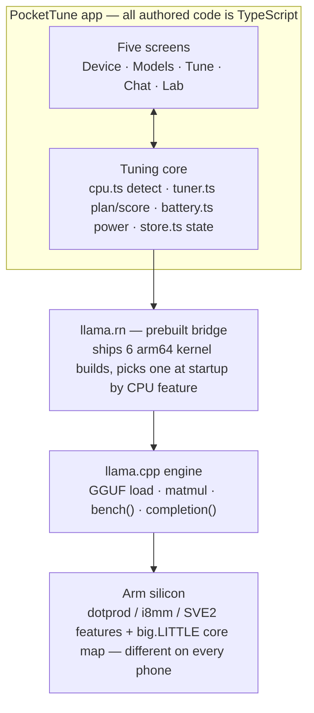
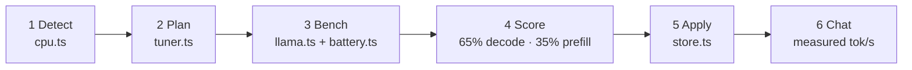
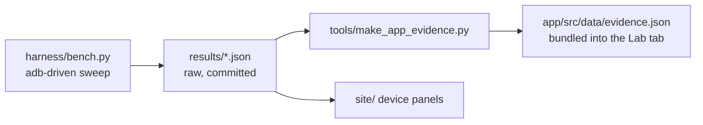

**Finds and applies the fastest local-LLM configuration for the phone it runs on.**

PocketTune is an Android app that detects your phone's Arm CPU features, benchmarks a sweep of
LLM inference configurations **on the device itself**, then recommends and applies the fastest
one — and gives you a fully offline chat app running on it.

Built for the [Arm Create: AI Optimization Challenge 2026](https://arm-ai-optimization-challenge.devpost.com/) (Mobile AI track).

> Arm phones differ in silicon. Some cores have `i8mm` matrix instructions, some only `dotprod`.
> The best quantization, kernel path, and thread layout differ per device, so PocketTune closes the
> loop on the device itself: **detect → sweep → recommend → apply.**

## Headline result

On the **Nothing Phone 2a** (MediaTek Dimensity 7200 Pro, an Armv9 chip with `i8mm`): **4.94×
faster prompt processing** — same phone, same Llama 3.2 1B Q4_0 model, same llama.cpp source —
from Arm-aware build flags (`armv8.2-a+dotprod+i8mm`) and llama.cpp's Q4_0 repack into
i8mm-friendly layouts (20.5 → 101.4 prefill t/s). Decode improves 1.34× (12.7 → 17.0 t/s).

Raw data: [results/](results/).

The size of that gain is a property of the silicon. A chip without `i8mm` has a different ceiling
and a different best config, so the app ships the loop rather than the result: it measures threads
× flash attention × KV-cache quant on whatever phone it is installed on.

## The app

Five tabs, all TypeScript (React Native + [llama.rn](https://github.com/mybigday/llama.rn)):

| Tab | What it does |
|---|---|
| **Device** | Reads `/proc/cpuinfo` + cpufreq topology: dotprod/i8mm/SVE2/SME2 checklist, big.LITTLE core map, which arm64 kernel variant the runtime dispatch selects |
| **Models** | Downloads and manages GGUF models (or picks up ones you `adb push`) |
| **Tune** | Runs a llama-bench-style sweep on-device (thread counts × flash attention × quantized KV cache), charts every config, recommends the winner, applies it in one tap |
| **Chat** | Offline assistant running the applied config, with measured tok/s on every reply |
| **Lab** | The published harness evidence (attribution ladder, thread-scaling curves) plus this phone's own tuning history — every number traceable to raw JSON in `results/` |

Where the kernel exposes the battery rails (`/sys/class/power_supply/battery`), the sweep also
reports **tokens per joule** per config.

llama.rn ships six arm64 kernel builds and picks one at runtime by CPU feature — an i8mm-capable
chip gets `v8_2_dotprod_i8mm`, a dotprod-only one gets `v8_2_dotprod`. That runtime dispatch is the
app-side equivalent of the explicit per-arch builds the harness compares.

## Quick start — run the app

Prereqs: Node ≥ 22, JDK 17+, Android SDK (a stock Android Studio install is fine), a phone with
USB debugging enabled.

```bash
git clone https://github.com/ayanbag/pockettune   # this repo
cd pockettune/app
npm install
npm run android          # builds and installs the debug app on the connected phone
```

Release APK: `cd app/android && ./gradlew assembleRelease` → `app/android/app/build/outputs/apk/release/app-release.apk`
(signed with the debug keystore — fine for sideloading).

Then in the app: **Tune tab → download a model → Run tuning sweep → Apply → Chat.**
No account, no network needed after the model download — airplane mode is the demo.

Tip: skip the in-app download by pushing a GGUF you already have:
`adb push model.gguf /sdcard/Android/data/com.pockettune/files/models/`

## Using the app

1. **Device** — open it first. It shows what the app detected on your phone: the CPU feature
   checklist (dotprod / i8mm / SVE2 / SME2), the core clusters with their max clocks, which cores
   are the big ones, and which of llama.rn's six arm64 kernel builds the runtime dispatch selected.
   Everything downstream depends on this detection being right.
2. **Models** — download a model (Llama 3.2 1B Q4_0 is the default pick, ~700 MB) or use one you
   pushed over adb. Everything after this step works offline.
3. **Tune** — pick **Quick** (~2 min: 64-token prefill / 24-token decode, 2 reps per config) or
   **Full** (128 / 48, 3 reps, plus the quantized-KV configs). The sweep charts each configuration
   as it lands: prefill tok/s, decode tok/s, and — where the kernel exposes the battery rails —
   tokens per joule. The recommended winner is scored 65% decode / 35% prefill (decode is what chat
   *feels* like). Tap **Apply**.
4. **Chat** — a fully offline assistant running the applied config. Every reply shows its measured
   decode speed.
5. **Lab** — the published harness evidence for benchmarked devices, plus this phone's own tuning
   history.

For sweep numbers you intend to compare or publish: charge above 30%, unplug, enable airplane
mode, and let the phone cool between runs — same rules the harness enforces.

## Architecture

Everything the user touches is TypeScript; everything fast is prebuilt native code selected by
runtime CPU-feature detection — no C++/Kotlin is written in this project.



The Tune tab is one loop:



The engine wrapper keeps **one llama context at a time** (a phone doesn't have RAM for two) and
serializes every native call, so a tab switch mid-benchmark can't interleave with a measurement.

The published evidence has its own pipeline, entirely outside the app:



### The optimizations, and what each achieved

| Lever | Kind | When | Result (Nothing 2a, Llama 3.2 1B Q4_0) |
|---|---|---|---|
| `-march=…+dotprod+i8mm` | SIMD code generation | build-time | **4.94× prefill, 1.34× decode** vs generic build |
| Weight repacking | data layout | model load | folded into the 4.94×; isolated by the `norepack` builds |
| KleidiAI kernels | kernel library | build-time | **≈0%** over arch flags for Q4_0 (see below) |
| Q4_0 quantization | memory traffic | model format | 1B model in ~700 MB; quant sweep (vs Q4_K_M, Q8_0) is next |
| Thread count | big.LITTLE scheduling | runtime, in-app | **+25% decode** (2 threads on big cores vs 6 mixed) |
| Flash attention, KV q8_0 | memory traffic | runtime, in-app | swept per device — helps some chips, hurts others |
| Tokens per joule | energy measurement | runtime, in-app | per-config efficiency, sampled from the battery rails |

Build-time levers arrive in the app pre-baked inside llama.rn's feature-dispatched kernels; the
runtime levers are the ones no binary can decide in advance, so the app measures them on the
phone it's installed on. Raw data for every measured claim: [results/](results/).

## Reproduce the published numbers (headless harness)

The numbers in `results/` come from `llama-bench` builds driven over adb — no app involved, so
anyone can verify them:

```bash
# 1. Cross-compile llama.cpp for Android (Windows/macOS/Linux; needs Android NDK + CMake)
#    Variants and exact flags are documented in docs/ — the key ones:
#      generic:  no arch flags (what a non-optimized app ships)
#      arch:     -march=armv8.2-a+dotprod+i8mm
#      kleidiai: arch flags + -DGGML_CPU_KLEIDIAI=ON

# 2. Run the sweep (pushes binaries + model, benchmarks, writes results/*.json)
python harness/bench.py --model models/Llama-3.2-1B-Instruct-Q4_0.gguf --variants generic arch kleidiai
```

Methodology: 5 repetitions per point, fixed prompt (128) and generation (64) lengths, 2-minute
cooldowns between variants, battery level and temperature recorded before and after each variant.

## Devices covered so far

Devices are listed here once they have run through the harness. This is the full extent of what has
been measured.

| Device | SoC | CPU features | Cores | Status |
|---|---|---|---|---|
| Nothing Phone 2a | MediaTek MT6886 (Dimensity 7200 Pro) | `asimddp`, **`i8mm`**, `sve2`, `bf16` | 2× A715 @ 2.8 GHz + 6× A510 @ 2.0 GHz | ✅ full build sweep in [results/](results/) |

The headline rests on `i8mm`, which many shipping Arm phones don't have. A dotprod-only chip takes
a different kernel path and has a different ceiling, which is why the app measures the phone it is
installed on rather than applying this table's conclusions.

**Adding your phone** takes one command and no code: see
[docs/testing-on-a-new-phone.md](docs/testing-on-a-new-phone.md). The harness detects the chip,
picks its build variants, and writes a `results/<device>-<timestamp>.json` — which is also the
unit the app's Lab tab and the project site consume.

## KleidiAI: no measurable gain here

On the i8mm chip measured so far, KleidiAI microkernels land **within noise of the plain
arch-flags build** for Q4_0: llama.cpp's own aarch64 repack path already exploits dotprod/i8mm
well. The 4.94× is therefore attributable to arch-aware codegen plus repacking, not to any single
kernel library. The attribution ladder in `results/` isolates each lever. This result is specific
to Q4_0 on this chip; other quantizations and other silicon may differ.

## Repository layout

```
app/       React Native app (TypeScript) — the product
  src/lib/    cpu.ts · tuner.ts · llama.ts · battery.ts — the tuning core
harness/   adb-driven benchmark harness — reproduce every published number
tools/     Python utilities (uv): evidence distillation for the app
models/    GGUF models used by the harness (not committed)
vendor/    llama.cpp source + cross-compiled build variants (not committed)
results/   Raw benchmark JSON — every published claim links here
docs/      Benchmark schema · how to add a new phone
site/      Project site
```

## License

[MIT](LICENSE)
